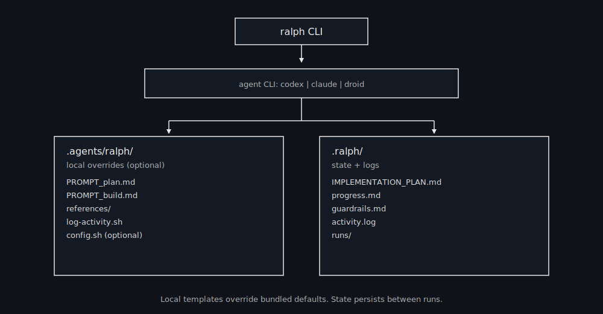

# Ralph


Ralph is a minimal, file‑based agent loop for autonomous coding. Each iteration starts fresh, reads the same on‑disk state, and commits work for one story at a time.

## How it works

Ralph treats **files and git** as memory, not the model context:

- **PRD** defines what’s required
- **Plan** breaks it into concrete tasks
- **Loop** executes one story per iteration
- **State** persists in `.ralph/`



## Global CLI (recommended)

Install and run Ralph from anywhere:

```bash
npm i -g @iannuttall/ralph
ralph prd "Describe the feature/app you want"
ralph plan
ralph build 1 # one Ralph run
```

### Template hierarchy

Ralph will look for templates in this order:

1. `.agents/ralph/` in the current project (if present)
2. Bundled defaults shipped with this repo

State and logs always go to `.ralph/` in the project.

### Install templates into a project (optional overrides)

```bash
ralph install
```

This creates `.agents/ralph/` in the current repo so you can customize prompts and loop behavior. During install, you’ll be asked if you want to add the required skills.

### Install required skills (optional)

```bash
ralph install --skills
```

You’ll be prompted for agent (codex/claude/droid) and local vs global install. Skills installed: **commit**, **dev-browser**, **prd**.
If you skipped skills during `ralph install`, you can run `ralph install --skills` anytime.

## Quick start (project)

1) Write your PRD (default path) or generate one:
```
ralph prd "A lightweight uptime monitor (Hono app), deployed on Cloudflare, with email alerts via AWS SES"
```
Requires the **prd** skill (install via `ralph install --skills`).

Default output:
```
.agents/tasks/prd.md
```

2) Generate a plan (PRD → plan):
```
ralph plan
```

3) Run one build iteration:
```
ralph build 1 # one Ralph run
```

No‑commit dry run:
```
ralph build 1 --no-commit # one Ralph run
```

Override PRD output for `ralph prd`:
```
ralph prd "..." --out docs/prd-api.md
```

### Why a PRD and a plan?

- **PRD**: requirements and acceptance criteria.
- **Plan**: concrete, ordered tasks derived from the PRD. The loop executes one story at a time.

## Override PRD/Plan paths

You can point Ralph at a different PRD or plan file via CLI flags:

```bash
ralph plan --prd docs/prd-api.md --plan .ralph/api-plan.md
ralph build 1 --prd docs/prd-api.md --plan .ralph/api-plan.md # one Ralph run
```

Optional progress override:

```bash
ralph build 1 --progress .ralph/progress-api.md # one Ralph run
```

Optional config file (if you installed templates):

```
.agents/ralph/config.sh
```

## Choose the agent runner

Set `AGENT_CMD` in `.agents/ralph/config.sh` to switch agents:

```
AGENT_CMD="codex exec --yolo -"
AGENT_CMD="claude -p --dangerously-skip-permissions \"$(cat {prompt})\""
AGENT_CMD="droid exec --skip-permissions-unsafe -f {prompt}"
```

Or override per run:

```
ralph prd "..." --agent=codex
ralph build 1 --agent=codex # one Ralph run
ralph build 1 --agent=claude # one Ralph run
ralph build 1 --agent=droid # one Ralph run
```

If the CLI isn’t installed, Ralph prints install hints:

```
codex  -> npm i -g @openai/codex
claude -> curl -fsSL https://claude.ai/install.sh | bash
droid  -> curl -fsSL https://app.factory.ai/cli | sh
```

## State files (.ralph/)

- `IMPLEMENTATION_PLAN.md` — task plan grouped by story
- `progress.md` — append‑only progress log
- `guardrails.md` — “Signs” (lessons learned)
- `activity.log` — activity + timing log
- `errors.log` — repeated failures and notes
- `runs/` — raw run logs + summaries

## Notes

- `.agents/ralph` is portable and can be copied between repos.
- `.ralph` is per‑project state.
- Use `{prompt}` in `AGENT_CMD` when the agent needs a file path instead of stdin.
- Examples: see `examples/commands.md`.

## Tests

Dry-run smoke tests (no agent required):

```bash
npm test
```

Fast agent health check (real agent call, minimal output):

```bash
npm run test:ping
```

Optional integration test (requires agents installed):

```bash
RALPH_INTEGRATION=1 npm test
```

Full real-agent loop test:

```bash
npm run test:real
```
